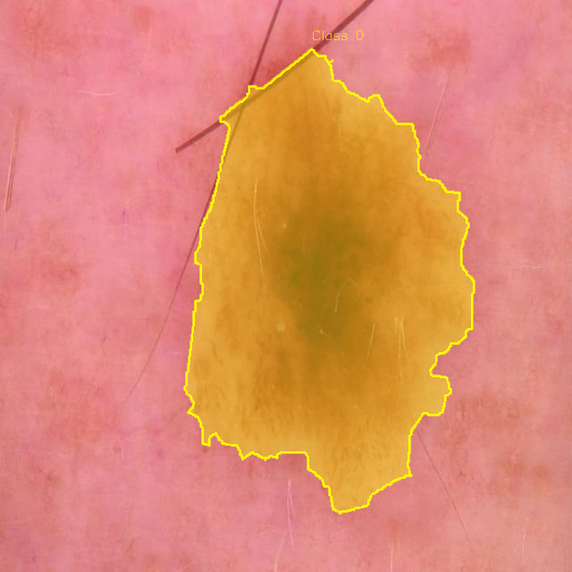

# Segment Toolkit

A modern, robust, and premium Python package designed to bridge the gap between pixel-level binary/colored segmentation masks and YOLO labels. It provides a bidirectional pipeline for both standard **Bounding Boxes** (YOLO object detection) and **Polygon Coordinates** (YOLO instance segmentation format). 

Equipped with a flexible image-mask transform pipeline, exception handling, extensive logging, a CLI, and a clean Python API.

---

## Features

- **Bidirectional Conversions**:
  - **Bounding Boxes**: Convert binary masks to YOLO format labels (supports standard axis-aligned or advanced minimum area rotated bounding boxes) and vice versa.
  - **Polygon Segmentation**: Convert binary or multi-class color-coded masks to YOLO instance segmentation polygon coordinates and vice versa.
- **Transform Pipeline (`Compose`, `Resize`, `Normalize`)**: Jointly apply spatial and pixel transforms (like resizing and normalizations) on both images and masks.
- **Robust Exception Handling**: Prevents crashes on corrupted, missing, or empty files.
- **Dynamic Dataset Matching**: Parse Ground Truth CSV or JSON files (supports multiple indicator formats) to automatically map filenames to diagnostic class IDs (e.g. standard ISIC classes).
- **YOLO Dataset Splitting**: Automatically partitions images and label files into standard `train` and `test` structures and generates the `data.yaml` configuration file.
- **Visualization Overlays**: 
  - Overlay bounding boxes onto source images.
  - Blend masks onto source images.
  - Render colored segmentation polygons with class tags onto source images.
- **Dual Interface**: Use as a command-line application (`segment-toolkit`) or import as a Python library (`import segment_toolkit`).

---

## Installation

### 1. Standard Installation (via PyPI)
```bash
pip install segment-toolkit
```

### 2. Local Development Installation
```bash
# Clone the repository
git clone https://github.com/zkzkGamal/mask-to-yolo-toolkit.git
cd mask-to-yolo-toolkit

# Install in editable mode
pip install -e .
```

---

## Command Line Interface (CLI)

The package installs a console script called `segment-toolkit`.

### 1. Bounding Box Conversions

#### Convert Masks to YOLO Bounding Boxes
```bash
# Single File
segment-toolkit mask-to-yolo \
  --image images/sample.jpg \
  --mask masks/sample.png \
  --output-txt labels/sample.txt \
  --class-id 4

# Batch Directory
segment-toolkit mask-to-yolo \
  --image-dir images/ \
  --mask-dir masks/ \
  --output-dir labels/ \
  --ground-truth GroundTruth.csv
```
*Options:*
- `--rotated`: Use rotated minimum area rectangles (`cv2.minAreaRect`) instead of standard axis-aligned boxes.
- `--resize WIDTH HEIGHT`: Set target size for resizing (default: 640 640).

#### Convert YOLO Bounding Boxes to Masks
```bash
# Single File
segment-toolkit yolo-to-mask \
  --label labels/sample.txt \
  --output-mask reconstructed/sample.png

# Batch Directory
segment-toolkit yolo-to-mask \
  --label-dir labels/ \
  --output-dir reconstructed/
```

#### Visualize Bounding Boxes
```bash
segment-toolkit visualize \
  --image images/sample.jpg \
  --label labels/sample.txt \
  --output visualization.png
```

---

### 2. Polygon Segmentation Conversions

#### Convert Masks to YOLO Polygon Labels
Supports standard black-and-white masks or multi-class colored masks (requires passing a `--classes` JSON config mapping colors to class names).
```bash
# Single binary mask
segment-toolkit mask-to-polygon \
  --image images/sample.jpg \
  --mask masks/sample.png \
  --output-txt labels/sample.txt \
  --class-id 1

# Batch directory of multi-class colored masks
segment-toolkit mask-to-polygon \
  --image-dir images/ \
  --mask-dir masks/ \
  --output-dir labels/ \
  --classes classes.json
```

#### Convert YOLO Polygons back to Masks
```bash
# Single file (creates color mask if classes.json is provided)
segment-toolkit polygon-to-mask \
  --label labels/sample.txt \
  --output-mask reconstructed/sample.png \
  --classes classes.json

# Batch directory
segment-toolkit polygon-to-mask \
  --label-dir labels/ \
  --output-dir reconstructed/
```

#### Visualize Polygon Segmentation
```bash
segment-toolkit visualize-polygon \
  --image images/sample.jpg \
  --label labels/sample.txt \
  --output polygon_overlay.png \
  --classes classes.json
```

---

### 3. Dataset Utilities

#### Split Dataset
Partitions image-label pairs into YOLO-compliant subfolders (`train/`, `test/`) and generates `data.yaml`:
```bash
segment-toolkit split \
  --images images/ \
  --labels labels/ \
  --output dataset/ \
  --ratio 0.8
```

---

## Validation Overlays

To verify the pipeline, check out the visualization overlays generated by running the test suite under the `scripts/` folder:

### Bounding Box Overlay (ISIC Skin Lesion)


### Bounding Box Overlay (Plant Disease)


### Polygon Segmentation Overlay (ISIC Skin Lesion)


### Reconstructed Mask Overlay (Multi-class Color Mask)


---

## Python API

Programmatically build custom preprocessing and conversion pipelines:

```python
from segment_toolkit import MaskToYoloConverter, YoloToMaskConverter
from segment_toolkit import MaskToPolygonConverter, PolygonToMaskConverter
from segment_toolkit.transforms import Compose, Resize, Normalize

# 1. Image & Mask Joint Transforms Pipeline
transform_pipeline = Compose([
    Resize((640, 640)),
    Normalize()
])

# 2. Bounding Box Converter
bbox_converter = MaskToYoloConverter(target_size=(640, 640), bbox_type="rotated")
bbox_converter.convert_single(
    image_path="images/sample.jpg",
    mask_path="masks/sample.png",
    output_txt_path="labels/sample.txt",
    class_id=0
)

# 3. Multi-class Colored Mask to Polygon Converter
classes = [
    ((255, 0, 0), "lesion_red"),
    ((0, 255, 0), "lesion_green")
]
poly_converter = MaskToPolygonConverter(target_size=(640, 640))
poly_converter.convert_single(
    image_path="images/sample.jpg",
    mask_path="masks/sample_colored.png",
    output_txt_path="labels/sample_poly.txt",
    classes=classes
)
```

---

## Ground Truth JSON Format Example
To feed multi-class configurations to CLI commands using `--classes`, prepare a JSON file listing color lists and class names:
```json
[
  [[255, 0, 0], "lesion_red"],
  [[0, 255, 0], "lesion_green"]
]
```

---

## License

This project is licensed under the MIT License - see the [LICENSE](LICENSE) file for details.

---

## Author

**Zakria Gamal**
- Computer Vision and AI Engineer
- LinkedIn: [Zakria Gamal](https://www.linkedin.com/in/zkaria-gamal-82b486267/)
