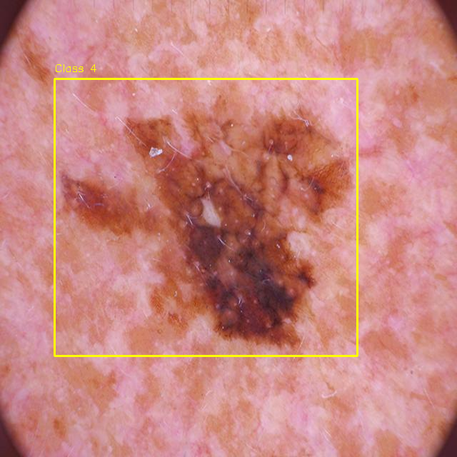
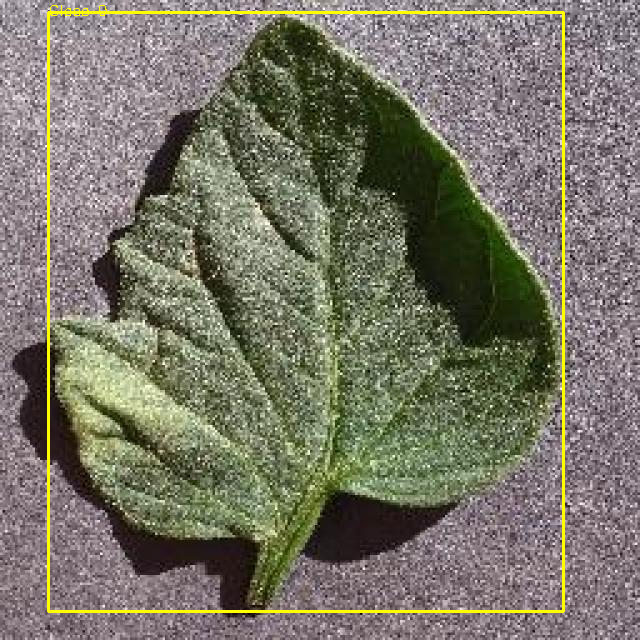

# Segment Toolkit

A modern, robust, and premium Python package designed to bridge the gap between pixel-level binary segmentation masks and YOLO bounding box labels. It provides a bidirectional pipeline with exception handling, extensive logging, a command-line interface (CLI), and a Python API.

---

## Features

- **Bidirectional Conversion**:
  - **Forward Pipeline**: Convert binary masks to YOLO format labels (supports standard axis-aligned or advanced minimum area rotated bounding boxes).
  - **Reverse Pipeline**: Reconstruct binary masks from YOLO labels.
- **Automatic Dependency Installer**: Missing required packages (numpy, opencv-python, pillow, pandas, matplotlib) are automatically detected and installed via pip upon package import or script execution.
- **Robust Exception Handling**: Try-catch blocks wrapped around file I/O, contour finding, and resizing to prevent application crashes on corrupted or missing files.
- **Dynamic Dataset Matching**: Read classification mappings (in CSV or JSON format) to automatically assign multi-class IDs matching standard dataset schemas (like the ISIC dataset).
- **YOLO Dataset Splitting**: Automatically shuffles and partitions images and labels into training and testing sets with customizable split ratios, creating standard data.yaml configs.
- **Overlay Visualizer**: Overlay bounding boxes and class indicators directly onto source images for annotation inspection.
- **Dual Interface**: Use as a command-line application (segment-toolkit) or import as a Python library (import segment_toolkit).

---

## Installation

### 1. Standard Installation (via PyPI)
To install the latest stable version of the package directly from PyPI:

```bash
pip install segment-toolkit
```

### 2. Local Installation (via Git Clone)
If you want to clone the repository for local development, run:

```bash
# Clone the repository
git clone https://github.com/zkzkGamal/mask-to-yolo-toolkit.git

# Navigate into the project folder
cd mask-to-yolo-toolkit

# Install in editable mode
pip install -e .
```

---

## Usage

### 1. Command Line Interface (CLI)

The package installs a console script called segment-toolkit.

#### Convert Masks to YOLO Labels
- **Single File Conversion**:
  ```bash
  segment-toolkit mask-to-yolo \
    --image images/ISIC_0024310.jpg \
    --mask mask/ISIC_0024310_segmentation.png \
    --output-txt labels/ISIC_0024310.txt \
    --class-id 4
  ```

- **Batch Directory Conversion**:
  ```bash
  segment-toolkit mask-to-yolo \
    --image-dir images/ \
    --mask-dir mask/ \
    --output-dir labels/ \
    --ground-truth GroundTruth.csv
  ```

- **Options**:
  - `--rotated`: Use rotated minimum area rectangles (cv2.minAreaRect) instead of standard axis-aligned rectangles.
  - `--resize WIDTH HEIGHT`: Set target size for image and mask resizing (default: 640 640).

#### Convert YOLO Labels to Masks
- **Single File Conversion**:
  ```bash
  segment-toolkit yolo-to-mask \
    --label labels/ISIC_0024310.txt \
    --output-mask masks_reconstructed/ISIC_0024310_segmentation.png
  ```

- **Batch Directory Conversion**:
  ```bash
  segment-toolkit yolo-to-mask \
    --label-dir labels/ \
    --output-dir masks_reconstructed/
  ```

#### Visualize Bounding Boxes
Draw YOLO labels on top of the original image:
```bash
segment-toolkit visualize \
  --image images/ISIC_0024310.jpg \
  --label labels/ISIC_0024310.txt \
  --output visualization.png
```

#### Split Dataset
Organize folders into YOLO-compliant structure (dataset/train and dataset/test splits) and output data.yaml:
```bash
segment-toolkit split \
  --images images/ \
  --labels labels/ \
  --output dataset/ \
  --ratio 0.8 \
  --seed 42
```

---

## Validation and Demonstration Outputs

To verify the library, we run automated validation on sample datasets. All validation output files (YOLO coordinates, reconstructed masks, and drawing overlays) are stored in the [validate_data/](file:///home/aloha-zkaria/LabelFile-for-yoloModel/validate_data) folder.

### Validation Overlays

Here are the bounding box overlays generated by the toolkit visualizer:

#### ISIC Melanoma Skin Lesion Validation
[](assets/scratch_val_isic_vis.png)

#### Plant Leaf Disease Validation
[](assets/scratch_val_plant_vis.png)

### Video Demonstration
A video demonstrating installation, CLI commands, and programming API pipelines can be placed in the [demo/](file:///home/aloha-zkaria/LabelFile-for-yoloModel/demo) directory.

---

## Ground Truth Formats

The --ground-truth parameter in batch conversion supports both CSV and JSON formats.

#### CSV Format
Assumes the first column contains the image identifier/filename, and the subsequent columns represent binary indicator classes (where 1 indicates class presence).
Example GroundTruth.csv:
```csv
image,MEL,NV,BCC,AKIEC,BKL,DF,VASC
ISIC_0024306,0,1,0,0,0,0,0
ISIC_0024310,1,0,0,0,0,0,0
```

#### JSON Format
Supports three distinct schemas:

1. **Flat Dictionary (Format A)**:
   Maps image IDs directly to class integers or class name strings.
   ```json
   {
     "ISIC_0024306": 5,
     "ISIC_0024310": "MEL"
   }
   ```

2. **Nested Indicators (Format B)**:
   Maps image IDs to dictionaries of binary class indicators.
   ```json
   {
     "ISIC_0024306": { "MEL": 0, "NV": 1, "BCC": 0 },
     "ISIC_0024310": { "MEL": 1, "NV": 0, "BCC": 0 }
   }
   ```

3. **List of Records (Format C)**:
   A list of objects containing image IDs and class descriptors.
   ```json
   [
     { "image": "ISIC_0024306", "class_id": 5 },
     { "image": "ISIC_0024310", "MEL": 1, "NV": 0 }
   ]
   ```

*Note: Class name strings (like "MEL", "NV") are automatically mapped to standard ISIC IDs (AKIEC=0, BCC=1, BKL=2, DF=3, MEL=4, NV=5, VASC=6). Custom column names default to index-based IDs.*

---

## Python API

Import classes directly into your code to programmatically build custom pipelines:

```python
from segment_toolkit import MaskToYoloConverter, YoloToMaskConverter

# 1. Convert mask to YOLO label
yolo_conv = MaskToYoloConverter(target_size=(640, 640), bbox_type="standard")
yolo_conv.convert_single(
    image_path="images/ISIC_0024310.jpg",
    mask_path="mask/ISIC_0024310_segmentation.png",
    output_txt_path="labels/ISIC_0024310.txt",
    class_id=4
)

# 2. Batch convert a folder of masks with a JSON ground truth
yolo_conv.convert_dataset(
    images_dir="images",
    masks_dir="mask",
    output_labels_dir="labels",
    ground_truth="GroundTruth.json"
)
```

---

## Technical Details

### Coordinate Conversion Math

#### Bounding Box Center Calculation (Pixel Space)
For standard bounding boxes, the pixel coordinates from boundingRect are (xmin, ymin, w_pixel, h_pixel).
$$\text{Center } X \quad x_{center} = x_{min} + \frac{w_{pixel}}{2.0}$$
$$\text{Center } Y \quad y_{center} = y_{min} + \frac{h_{pixel}}{2.0}$$

#### Coordinate Normalization (YOLO Format)
All coordinates are normalized to the range [0.0, 1.0]:
$$x_{norm} = \frac{x_{center}}{img\_width}, \quad y_{norm} = \frac{y_{center}}{img\_height}$$
$$w_{norm} = \frac{w_{pixel}}{img\_width}, \quad h_{norm} = \frac{h_{pixel}}{img\_height}$$

---

## Author
**Zakria Gamal**
- Computer Vision and AI Engineer
- LinkedIn: [Zakria Gamal](https://www.linkedin.com/in/zkaria-gamal-82b486267/)
